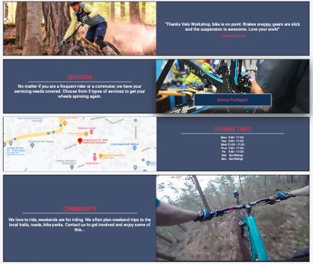

# Velo Workshop

Velo Workshop aims to make getting a bike serviced or fixed a simpler task for the rider. By creating an online presence where the rider can be introduced and find Velo Workshop easily. In times of need, for example an emergency puncture, the rider can contact them directly via the contact information provided or simply follow the online map to the workshop. 

More specifically this platform provides the rider with a simple and easy way to book their bike in for service, choosing from 3 types. Leisure, Weekend Rider and Pro service options are given, detailling a breakdown in costs, duration of work and what can be expected from each service. By booking in ahead of time they can plan ahead, and ensure the level of service they want can be given.

## Site Goals/ Strategy

Velo Workshop is useful to the rider as they can find a nearby mechanic, book servicing ahead of time, speak to a professional and realise a community. It is useful to the owner as it helps market a service to the user, provide an overview of their qualifications and achievements creating a trust within the industry and reduse phone calls regarding servicing, leaving more time for mechanics.

## Site Wide Features

### - __Header__

- Logo 

The simple logo remains the same size and in the same location throughout. When clicked it provides a link back to the home page.

- Navbar

The navbar contains links to the home (index.html), servicing and our team page, it remains at the top of the page and consistent throughout making it simple to navigate the site, when hovered it shows red providing more clarity. Home, Servicing and Our Team are listed in order of importance to the site and user.

### - __Footer__

The footer sits at the bottom of the page across the site, it holds the contact details and social media links, this is normal for most websites and so it is easy for the user to recognise its usage. Just like the nav the links turn red when hovered helping users understand that it is a link.

### - __Page Intro__

Featured on both the services and team page the page intro section provides brief information to provide a little more content to the information on the page. It is always style the same making navigation through each of these informative pages easy.

## Features by Page

### - __Home__

The main section of the home page begins with a large image, followed by 4 informative sections. Each section has the same style, information on one side and some visual content on the other. When hovered over they appear to stand out with shadow, providing interaction. The sections were chosen as they quickly answer initial questions asked by the user. Are they good mechanics? What is the service they offer? Where are they? When can i go?

- Main Image

The main image is used to portray the workshop environment of Velo Workshop. The workshop is well stocked with tools and parts and has the tools cleanly placed in their correct spaces. The main mechanic in the image is smiling showing friendliness and pleasure in his work. The image was chosen as it provides the user with an insight into how the workshop is running. It is clean, but productive and the mechanics look to be interested and friendly. It is positioned so that the user immediately sees this when entering the site. 

 

- Testimonial

A testimonial is provided at the top of the page, its a review which immediately provides the user with real feedback of what to expect from a previous user. It is used to build trust in new users. The target user here is a passionate cyclist someone who needs to know if we have taken good care of previous customers.

- Servicing

In the servicing section a short and punchy intro to our servicing is followed by a call to action. An interative button linked to more information on the servicing page. It contrasts well with the background and responds when hovered over. The button writing then turns red to signal that this is link as the user will learn quickly as they navigate the site.

- Location

The location section provides an interactive map for the user to find us easily. Next to this map are the opening times with days off, referencing riding a bike to further build a connection with the user. These are paired as most users when finding a location will next ask the question, "when is it open?"

- Community

Finally in the community section there is an invite to connect with the Velo Workshop community and join them on a ride. Next to it, a video, showing some footage of a ride by one of our community members. It is tempting the user to connect with them. Again here the target user is a passionate cyclist.

### - __Servicing__

This page further breaks down the servicing packages and helps the user decide on which one is best suited to their needs. At the bottom is a small gallery of images displaying the workshop. 

- Types of servicing

In this section the servicing types are described in more detail. Giving the costs, features and duration of each service. Each service type is named and coloured differently. Whilst maintaining the site wide patterns of heading and information colors. Each type contains a **Book Now!** button. The button is styled the same across the site making it easily memorable that clicking here is move towards the act of booking. Another feature specific to the servicing page is the interactive containers which grow from 30% to 33% as you hover.

- Workshop Gallery

Used to further the users understanding of the workshops competence. Clean workshop images are used with the correct and necessary tools displayed.

### - __Our Team__

A team page is used in order to build trust in the user and familiarity with the mechanics. Showing qualifications and achievements shows the user the team members are proffesionally trained and knowledgable, not just someone who can fix a tire. It shows high standards to the user whilst showcasing the skills of the Velo Workshop.

- Profile Sections

Each profile is simply designed to showcase each team members valuable attributes and skills. An image followed by name, position in the company, a brief intoduction, qualifications and achievements. They are similarly styled the same as the home page in. Media followed by information, whilst being interactive when hovered over.

### - __Form__

The form page is simple but clear, providing inputs for the necessary information on the left and on the right providing inputs related to bikes and riding. Again showing the user we are passionate cyclists as well as professional mechanics. The call to action once again is styled in a way which by now the user will fully understand its purpose. At the very bottom a scrollable t&c's area for any questions regarding finer details.

### - __Thankyou__

The final page on the journey to booking a service is a confirmation page. Here the user gets visual feeback on completing the form. The user is briefly thanked and offered an option to call, if they still have questions or concerns. The last feature is a **Back to Home** button. The page is styled using the page-intro styling for consisitency.

## Potential Future Features

In the future an extra section would be added to the servicing page titled "Other" for users to specify and book smaller jobs.

A bike fitting section for cyclist to get correct and professional fittings and sizings carried out.

Another page where users can visit to learn how they can maintain their own bicycle better, including videos and item lists for tools and parts.

## Testing

On completion the site was tested across multiple browsers and platforms. The site has been built using Chrome, therefore it was also tested across Microsoft Edge and Firefox for desktops and larger screen sizes, whilst tested using Safari and Chrome on mobile and tablet devices.

### - __Screen Testing__

The site was screen tested for reponsiveness locally using Chrome developer tools and also across real devices. These included: 
- __Desktops and Monitors__
    - Large HD desktop monitor
    - Standard PC monitor
    - Laptop (Apple MacBook)
- __Phones and Tablets (landscape and portrait)__
    - iPad
    - iPhone X
    - iPhone 6s
    - Samsung Galaxy Xcover

### - __Testing Responsive Design__

Initially when testing the site some issues were encountered when scaling down, for example the hover effect used to expand the services section were no longer user friendly and altered the positioning of the containers. In order to counteract such errors the page structure was forced to change. Simply switching from rows to columns within each pages' main informative section and removing such hover effects would fix the issue. 

### Problems and Bugs: 

- __Row to column__

    - The initial problem when first attempting to make this response happen was the complexity of vertical alignment. When researching alternative methods it was found that Flex Box would be the alternative. This however meant altering the original core CSS before implementing the media queries needed. 

 

- __Responsive Form and Text__

    - Another issue arose when reaching smaller screen sizes in portait mode. Font size and text alignment needed to be altered in order to be user friendy. For example the form could no longer be provided in one screen width, therefore the alignment was altered to hug the left of the screen creating a long form whilst maintaining the styles. In fact this left alignment was introduced to large elements of text when this media querie was reached, as it provided much better readability to the user.

 

- __Image File Size__

    - A time consuming issue was reached when running a Lighthouse analysis. It showed the performance of the home page to be extremely low at a score of 49. To fix this issue all image files, site wide, had to be compressed. In doing so it was discovered that an even more current and supported file type 'webp' was also available. This meant converting images from jpg - webp and finally compressing the new webp files. On completion of this task the images had drastically reduced in file size, increasing the performance score of tthe home page to 75. 

 

### Lighthouse Analysis

The original Lighthouse Analysis conducted showed high scores for 'Accessibility' and 'SEO' but a sub optimal score for 'Best Practices' and a low score as discussed above for 'Performance'.

To fix these unwanted scores it entailled first compressing image files but also addressing the errors within 'Best Pratices'. When complete the lighthouse analysis of each page improved greatly.

## Validation

### - __HTML__

No errors or warnings were shown when passing code through the [W3C Validator](https://validator.w3.org/nu/?doc=https%3A%2F%2Fmtmanning93.github.io%2Fvelo-workshop%2F)

### - __CSS__

No errors or warnings were shown when passing code through the [Jigsaw CSS Validator](http://jigsaw.w3.org/css-validator/validator?lang=en&profile=css3svg&uri=https%3A%2F%2Fmtmanning93.github.io%2Fvelo-workshop%2F&usermedium=all&vextwarning=&warning=1)

## Deployment

The site was deployed to GitHub Pages using the following method:

- In the GitHub repository, navigate to the Settings tab
- From the source section drop-down menu, select the Master Branch
- Once the master branch has been selected, the page will be automatically refreshed with a detailed ribbon display to indicate the successful deployment.

The link to the live website is here - (*)

## Credits

### Content:

- Fonts

    Both fonts used (Roboto and Roboto Condensed) were taken from [Google Fonts](https://fonts.google.com/)

- Color Pallette

    Selected colors were chosen through this palette [Colorhunt](https://colorhunt.co/palette/f5f5f5f0545430475e121212)

 - Header: Logo and Nav

    The logo and nav original structure and style were taken from the ['Love Running'](https://github.com/Code-Institute-Org/love-running-2.0) follow along from Code Institute.

- Icons

    Icons used in the logo and social icons found in the footer were taken from [Font Awesome](https://fontawesome.com/)

- Structure

    Tutorials and instructions based on **Flex Box** were taken from two sources - [MDN Web Docs](https://developer.mozilla.org/en-US/docs/Web/CSS/flex) and [W3 Schools](https://www.w3schools.com/cssref/css3_pr_flex.php)

    Our Team profile cards (found on during design phase) - [Bikeaholic NZ](https://www.bikeaholic.co.nz/pages/our-team)

    3 service structure inspiration (found on during design phase) - [NipNip](https://www.nipnip.co.uk/book-a-service/), [Bikeaholic](https://www.bikeaholic.co.nz/pages/servicing)

    Main home page section idea was taken from [Code Institute Dashboard](https://learn.codeinstitute.net/dashboard)

- Hover Effects

    Inspiration and guidance for button and link hover effect came from multiple sources - [Free Frontend](https://freefrontend.com/css-hover-effects/), [W3 Schools](https://www.w3schools.com/cssref/sel_hover.php)

- Box Sizing

    Tutorial and Instructions from [MDN Web Docs](https://developer.mozilla.org/en-US/docs/Web/CSS/box-sizing)

- Child Selectors

    Tutorial of 'nth child selectors' [W3 Schools](https://www.w3schools.com/cssref/sel_nth-child.php)

### Media

- Main Image

    The hero image was taken from [Freepik](https://www.freepik.com/free-photo/good-teamwork-two-nice-mans-busy-bicycle-workshop-mans-are-wearing-checkered-shirts_29998005.htm#query=bicycle%20mechanics&position=32&from_view=search&track=sph). The attributed artist: fxquadro on Freepik

- Other Images

    All other images found on the Velo Workshop site are from [Unsplash](https://unsplash.com/). The attributed artists are: Greg Trowman, Anton Savinov, Axel Brunst, Thomas Schweighofer, Markus Spiske.

- Map (iframe)

    Map iframe taken from [Google Maps](https://www.google.com/maps/place/Hauptstrasse+22,+3800+Matten+bei+Interlaken/@46.680955,7.8610284,17z/data=!3m1!4b1!4m5!3m4!1s0x478fa482ae028d95:0x404504a5e71d713e!8m2!3d46.680955!4d7.8632171)

- Video

    The video used was taken from [Pixabay](https://pixabay.com/videos/mountain-bike-enduro-sports-nature-18215/)

    