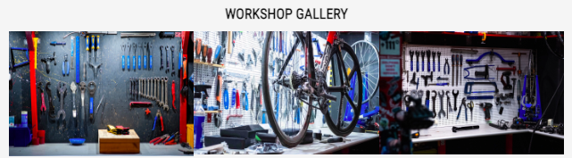

# Velo Workshop

Velo Workshop aims to make getting a bike serviced or fixed a simpler task for the rider. By creating an online presence where the rider can be introduced and find Velo Workshop easily. In times of need, for example an emergency puncture, the rider can contact them directly via the contact information provided or simply follow the online map to the workshop. 

More specifically this platform provides the rider with a simple and easy way to book their bike in for service, choosing from 3 types. Leisure, Weekend Rider and Pro service options are given, detailling a breakdown in costs, duration of work and what can be expected from each service. By booking in ahead of time they can plan ahead, and ensure the level of service they want can be given.

## Site Goals/ Strategy

Velo Workshop is useful to the rider as they can find a nearby mechanic, book servicing ahead of time, speak to a professional and realise a community. It is useful to the owner as it helps market a service to the user, provide an overview of their qualifications and achievements creating a trust within the industry and reduse phone calls regarding servicing, leaving more time for mechanics.

## Site Wide Features

### - __Header__

- Logo 

The simple logo remains the same size and in the same location throughout. When clicked it provides a link back to the home page.

- Navbar

The navbar contains links to the home (index.html), servicing and our team page, it remains at the top of the page and consistent throughout making it simple to navigate the site, when hovered it shows red providing more clarity. Home, Servicing and Our Team are listed in order of importance to the site and user.

### - __Footer__

The footer sits at the bottom of the page across the site, it holds the contact details and social media links, this is normal for most websites and so it is easy for the user to recognise its usage. Just like the nav the links turn red when hovered helping users understand that it is a link.

### - __Page Intro__

Featured on both the services and team page the page intro section provides brief information to provide a little more content to the information on the page. It is always style the same making navigation through each of these informative pages easy.

## Features by Page

### - __Home__

The main section of the home page begins with a large image, followed by 4 informative sections. Each section has the same style, information on one side and some visual content on the other. When hovered over they appear to stand out with shadow, providing interaction. The sections were chosen as they quickly answer initial questions asked by the user. Are they good mechanics? What is the service they offer? Where are they? When can i go?

 

- Main Image

The main image is used to portray the workshop environment of Velo Workshop. The workshop is well stocked with tools and parts and has the tools cleanly placed in their correct spaces. The main mechanic in the image is smiling showing friendliness and pleasure in his work. The image was chosen as it provides the user with an insight into how the workshop is running. It is clean, but productive and the mechanics look to be interested and friendly. It is positioned so that the user immediately sees this when entering the site. 

- Testimonial

A testimonial is provided at the top of the page, its a review which immediately provides the user with real feedback of what to expect from a previous user. It is used to build trust in new users. The target user here is a passionate cyclist someone who needs to know if we have taken good care of previous customers.

- Servicing

In the servicing section a short and punchy intro to our servicing is followed by a call to action. An interative button linked to more information on the servicing page. It contrasts well with the background and responds when hovered over. The button writing then turns red to signal that this is link as the user will learn quickly as they navigate the site.

- Location

The location section provides an interactive map for the user to find us easily. Next to this map are the opening times with days off, referencing riding a bike to further build a connection with the user. These are paired as most users when finding a location will next ask the question, "when is it open?"

- Community

Finally in the community section there is an invite to connect with Velo Workshop and join them on a ride. Next to it, a video, showing some footage of a ride by one of our community members. It is tempting the user to connect with them. Again here the target user is a passionate cyclist.

### - __Servicing__

This page further breaks down the servicing packages and helps the user decide on which one is best suited to their needs. At the bottom is a small gallery of images displaying the workshop. 

- Types of servicing

In this section the servicing types are described in more detail. Giving the costs, features and duration of each service. Each service type is named and coloured differently. Whilst maintaining the site wide patterns of heading and information colors. Each type contains a **Book Now!** button. The button is styled the same across the site making it easily memorable that clicking here is move towards the act of booking. Another feature specific to the servicing page is the interactive containers which grow from 30% to 40% as you hover.

- Workshop Gallery

Used to further the users understanding of the workshops competence. Clean workshop images are used with the correct and necessary tools displayed.